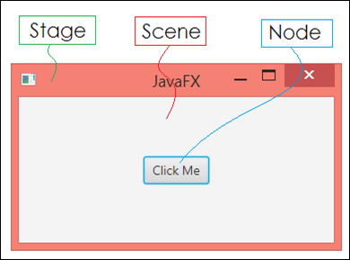
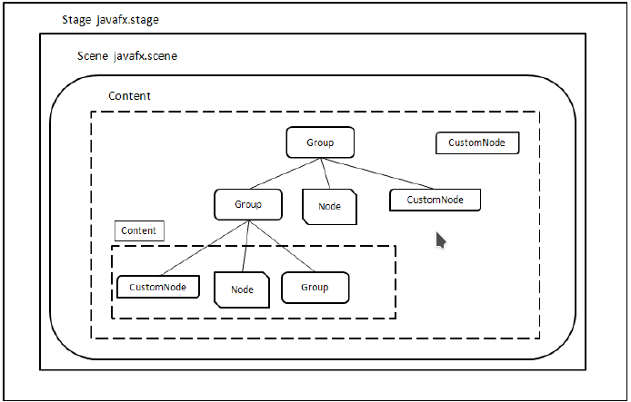
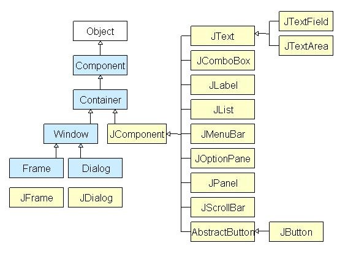
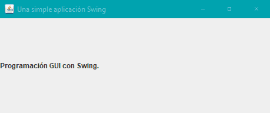
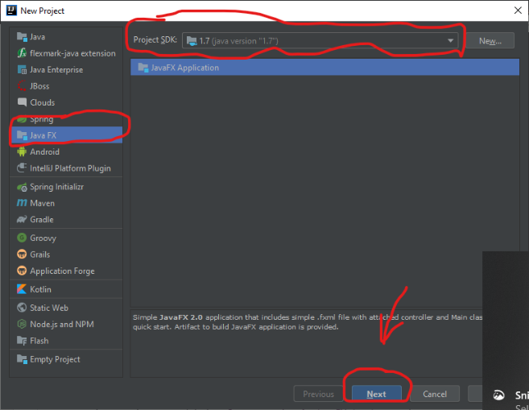
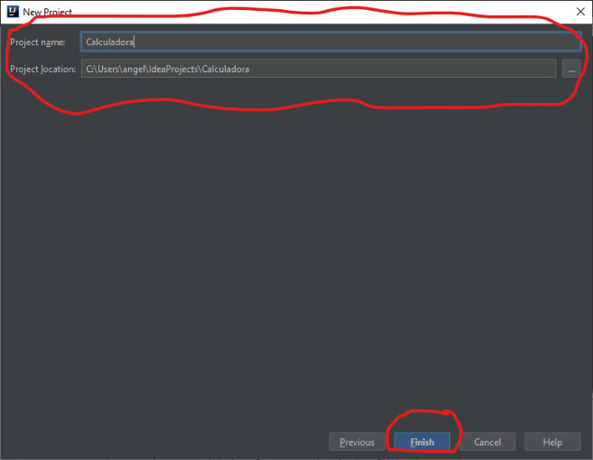

# Investigacion sobre JavaFX

## Contenido
1. [JavaFX](#java-fx)
   1. [Funcionamiento]()
   2. [Contexto]()
   3. [Sintaxis]()
2. [Java Swing](#java-swing)
   1. [Funcionamiento]()
   2. [Contexto]()
   3. [Sintaxis]()
3. [Diferencias entre JavaFX y Swing](#dif-fx-swing) 
4. [Calculadora cientifica en JavaFX](#cal-java-fx)
   1. [Explicacion del desarrollo]()
   2. [Resultados]()
5. [Entegrables](#entre)
   1.   [Reporte]()
   2. [Código]()
   
****   
### JavaFX 
****

 JavaFX es una tecnología de software que, combinada con Java, permite crear y desplegar aplicaciones, es decir, es un conjunto de gráficos y paquetes de comunicación que permite a los desarrolladores diseñar, crear, probar, depurar y desplegar aplicaciones cliente, que operan constantemente a través de diversas plataformas.<br/>
 
 Contiene un ambiente de ejecución de plataforma cruzada(Java  SE,  Java  EE,  ME) y  una  plataforma  específica.
 
 *Características principales de JavaFX:*
 
   * Permite a los desarrolladores integrar gráficos vectoriales, animación, sonido y activos web de vídeo en una aplicación interactiva, completa y atractiva.
   * Amplía la tecnología Java permitiendo el uso de cualquier biblioteca de Java en una aplicación JavaFX.
   * Permite mantener un eficaz flujo de trabajo entre diseñador y desarrollador en el que los diseñadores pueden trabajar en las herramientas que deseen mientras colaboran con los desarrolladores.

#### Funcionamiento
En la estructura del proyecto, se suelen generar 3 apartados:
   
   *Ejemplos:*
   
    FXMLDocument.fxml
    FXMLDocumentController.java
    JavaFXApplication1.java

**FXMLDocument.fxml** 
    El archivo FXMLDocument.fxml hace referencia en su código a la clase Java FXMLDocumentController, al usar FXML es mucho mas sencillo adaptar las ventanas y paneles a los diferentes tamaños necesarios.
    
**FXMLDocumentController.java**
    La clase Java FXMLDocumentController que va a hacer las funciones de controlador, gestionando las acciones que realice el usuario sobre los elementos de la ventana. 

**JavaFXApplication1.java**
    La clase java JavaFXApplication1 es la principal del proyecto, y será la que inicia la ejecución de la aplicación. En su código fuente se encarga de cargar la estructura de la ventana contenida en el archivo FXMLDocument.fxml


FXML proporciona una forma declarativa para definir interfaces de usuario en JavaFX, pero no se puede usar para definir el comportamiento. Se puede especificar un controlador para proporcionar el comportamiento requerido.
  
#### Contexto
Con JavaFX puedes construir muchos tipos de aplicaciones. Por lo general, son las aplicaciones de red y estas que se implementan a través de múltiples plataformas y mostrar información en una interfaz de usuario moderna de alto rendimiento que cuenta con audio, vídeo, gráficos y animación.

***
**Estructura de una aplicacion JavaFX:**
* Stage (Escenario): Es el contenedor de nivel superior y contiene la escena.
* Scene (Escena): Contiene los nodos(controles) que conforman la parte grafica de la escena.
* Nodos(Controles): Son los componentes que permiten al usuario interactuar con la aplicación.
 
 
***

#### Sintaxis 
JavaFX tiene su propio lenguaje de programación llamado JavaFX Script, fx es la extensión que presentan los archivos fuente.
  
 

Los *paquetes* son los encargados de contener la aplicación y librerías requeridas para desplegar en el emulador a frase "Hello World".
   
    package helloworld;
    import javafx.stage.Stage;
    import javafx.scene.Scene;
    import javafx.scene.text.Text;
    import javafx.scene.text.Font;
    import javafx.scene.paint.Color;
        
  
En *Stage* se indica el nombre de la aplicación y en caso de ser ejecutada en un applet se delimitan las dimensiones:
    
    Stage { 
        titile: "Ejemplo basico"
        width:250
        height:80

    
En *Scene* se encuentran los elementos  gráficos que van a intervenir durante la ejecución:
    
    scene: Scene{
        content: {
             Text {
                font : Font {
                    size : 16
                 }
                 fill: Color.Blue
                 x:40
                 y:80
                 content: "Hello World"
             }
        }
    }
    }


**** 
### JavaSwing
****

 Es parte de la JFC (Java Foundation Classes) en la plataforma Java, la cual provee facilidades para ayudar a la gente a construir la interfaz grafica de usuario, abarca botones, tablas, marcos, listas desplegabes entre otros.
         
 
 *Algunas de sus ventajas son:*
   * El diseño en Java puro posee menos limitaciones de plataforma. 
   * El desarrollo de componentes Swing es más activo. 
   * Los componentes de Swing soportan más características. 
  
#### Funcionamiento
Una aplicación Swing se construye mezclando componentes con las siguientes reglas:

  * Debe existir, al menos, un contenedor de alto nivel (Top-Level Container), que provee el soporte que los componentes Swing necesitan para el pintado y el manejo de eventos.
  * Otras componentes colgando del contenedor de alto nivel (éstas pueden ser contenedores o componentes simples). 


Cada aplicación Swing debe tener al menos un top-level container que contendrá toda la aplicación, estos pueden ser:

    javax.swing.JFrame: Una ventana independiente.
    javax.swing.JApplet: Un applet.
    Diálogos: ventanas de interacción sencilla con el usuario como por ejemplo:
        java.swing.JOptionPane: Ventana de diálogo tipo SI_NO, SI_NO_CANCELAR, ACEPTAR, etc...
        java.swing.JFileChooser: Ventana para elejir un archivo.
        java.swing.JColorChooser
        
A un contenedor se le pueden agregar otros contenedores o componentes simples.
 
#### Contexto
Swing fue desarrollado para proporcionar un sofisticado conjunto más del GUI componentes que el anterior Window Toolkit Resumen.
Incluye widgets para interfaz gráfica de usuario tales como cajas de texto, botones, desplegables y tablas. 

Swing existe desde la JDK 1.1, antes de la existencia de Swing, las interfaces gráficas con el usuario se realizaban a través de AWT (Abstract Window Toolkit), de quien Swing hereda todo el manejo de eventos. 
 ***
    
  **Diagrama de jerarquía de la clase Java Swing**
        
 
 
 ***
 
#### Sintaxis 
El siguiente programa muestra una forma de escribir una aplicación Swing. En el proceso, utiliza dos componentes Swing: JFrame y JLabel. 

   **JFrame** es el contenedor de nivel superior que se usa comúnmente para las aplicaciones Swing.     
   **JLabel** es el componente de Swing que crea una etiqueta, que es un componente que muestra información.


    // Los programas Swing deben importar java.swing.
    import javax.swing.*;
    public class SwingDemo {
        SwingDemo(){
            // Crea un nuevo contenedor JFrame.
            JFrame jfrm=new JFrame("Una simple aplicación Swing");
            // Se le da al cuadro un tamaño inicial.
            jfrm.setSize(475,200);
            // Termine el programa cuando el usuario cierre la aplicación.
            jfrm.setDefaultCloseOperation(JFrame.EXIT_ON_CLOSE);
            // Crea una etiqueta basada en texto.
            JLabel jLabel= new JLabel("Programación GUI con Swing.");
            // Agregue la etiqueta al panel de contenido (content pane).
            jfrm.add(jLabel);
            // Visualiza el marco.
            jfrm.setVisible(true);
        }
        public static void main(String[] args) {
            SwingUtilities.invokeLater(new Runnable() {
                public void run(){
                    new SwingDemo();
                }
            });
        }
    }

Los programas Swing se compilan y ejecutan de la misma manera que otras aplicaciones Java. 


  Por lo tanto, para compilar este programa, puede usar esta línea de comando:

    javac SwingDemo.java

Para ejecutar el programa, use esta línea de comando:

    java SwingDemo    
 
Cuando se ejecuta el programa, producirá la ventana que se muestra en la siguiente imagen:
        
 
   
***

### Diferencias entre JavaFX y JavaSwing
*Algunas de las diferencias más importantes son:*
* JavaFX soporta propiedades a través de sus clases, por lo tanto JavaFX proporciona manejo de eventos que son inauditos en Swing.
* JavaFX pueden ser personalizados con CSS, puedes controlar el formato a través de CSS. Los aspectos de apariencia pueden ser configurados mediante reglas de estilo y cambiar la apariencia por medio de la llamada de un método.
* Las animaciones son mucho mas sencillas en JavaFX, debido a que cuentan con un soporte incorporado y para animaciones sofisticadas y JavaSwing no provee ningún soporte directo.
* En Java Swing, un layout es asociado con un JPanel y en JavaFX, los layouts son subclases de la clase Node.
* Swing carece de soporte para dispositivos modernos con interfaces touch, por el contrario JavaFX tiene soporte incorporado para gestos comunes en interfaces touch.
* JavaFX no tiene un equivalente a JOptionPane como en Swing, el cual es útil para mostrar mensjes de alerta u obtener respuesta del usuario..
 
****
### Calculadora cientifica en JavaFX
A continuacion se presenta el proceso del desarrollo de la calculadora cientifica con JavaFX
#### Requisitos
Para poder crear aplicaciones con JavaFX es necesario contar con un JDK 7.80 o inferior, ya que las versiones recientes dejaron a Java FX fuera del paquete del JDK.
[(Pueden descargar aqui la version 7u80 del JDK de Java)](https://www.oracle.com/technetwork/java/javase/downloads/java-archive-downloads-javase7-521261.html)

(Opcionalmente)
Para lograr una buena experencia con el diseno de las interfaces en JavaFX, Oracle sigue poniendo a disposicion una herramienta libre llamada [JavaFX Scene Builder](https://www.oracle.com/technetwork/java/javase/downloads/javafxscenebuilder-info-2157684.html), que nos permite visualizar las interfaces disenadas con JavaFX, sin necesidad de codificar esas interfaces. 

#### Empezemos
Para iniciar, debemos de aclarar que cada IDE (NetBeans, IntelliJ, Eclipse, etc) tiene sus propias funcionalidades para crear plantillas para crear la base de una app JavaFX.

En este caso, para IntelliJ el procedimiento estara en este [link](https://www.jetbrains.com/help/idea/preparing-for-javafx-application-development.html).

Una vez que abran sus IDE favorita, deberan de crear un nuevo proyecto.
Tomen en cuenta que para crear una app JavaFX deberan de tener ya instalado una version que lo soporte (<= 7u18)  



Asignen un nombre al proyecto.



Una vez que ya allan hecho todos los pasos anteriores correctamente. La IDE les creara tres archivos necesarios para el dessarrollo de la app.

**sample.fxml**

```
<?xml version="1.0" encoding="UTF-8"?>
<?import javafx.geometry.Insets?>
<?import javafx.scene.layout.GridPane?>
<?import javafx.scene.control.Button?>
<?import javafx.scene.control.Label?>
<GridPane fx:controller="Controller"
          xmlns:fx="http://javafx.com/fxml" alignment="center" hgap="10" vgap="10">
</GridPane>
```  

**Controller.java**

```
public class Controller {

} 
```

**Calculadora.java** 
``` 
import javafx.application.Application;
import javafx.fxml.FXMLLoader;
import javafx.scene.Parent;
import javafx.scene.Scene;
import javafx.stage.Stage;

public class Calculadora extends Application {

    @Override
    public void start(Stage primaryStage) throws Exception{
        Parent root = FXMLLoader.load(getClass().getResource("sample.fxml"));
        primaryStage.setTitle("Hello World");
        primaryStage.setScene(new Scene(root, 300, 275));
        primaryStage.show();
    }


    public static void main(String[] args) {
        launch(args);
    }
}
```

Si compilamos y ejecutamos la aplicacion, el resultado seria algo asi.


<!--[Seguimiento](https://javiergarciaescobedo.es/programacion-en-java/96-javafx/399-primeros-pasos-con-javafx-scene-builder-y-netbeans)-->

<!--[Seguimiento 2](https://www.oracle.com/technetwork/es/articles/java/fxmlloader-parte-2-4416148-esa.html)-->

#### Explicacion del desarrollo

Para agregar un elemento a la vista, por ejemplo un boton. Se tendra que
agregar el siguiente codigo en fxml
```
<Button id="btnVaciar" onAction="#onClickBtnBorrar" layoutX="240.0" layoutY="74.0" mnemonicParsing="false" prefHeight="45.0" prefWidth="45.0" text="DEL" textAlignment="CENTER">
</Button>
```

En este componente se agregaron los siguientes parametros:
- [id] Aqui se agrega un id al elemento, con esto se podra usar el
  elemento en el controlador.
- [onAction] Aqui se enlaza la funcion que esta en el controlador, por
  ejemplo, el componente anterior tiene un enlace con la funcion con la
  funcion *onClickBtnBorrar*. *Nota. Para que el fxml detecte la funcion
  enlazada necesita la etiqueta @FXML antes de la funcion.*
  ```
  @FXML
    private void onClickBtnBorrar()throws Exception {
        /*Funcionamiento del boton*/
    }
  ```
- [layoutX] Posicion en X
- [layoutY] Posicion en Y
- [text] Texto que lleva en el elemento 
- [Entre otras] prefWidth, prefHeigth, textAlignment

